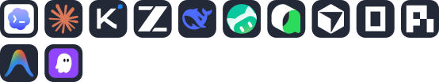

### 🛠️ Technical Stack

  

### 🤖 AI Stack

  

---

<picture>
  <source media="(prefers-color-scheme: dark)" srcset="https://raw.githubusercontent.com/MDSIXONE/MDSIXONE/output/github-contribution-grid-snake-dark.svg">
  <source media="(prefers-color-scheme: light)" srcset="https://raw.githubusercontent.com/MDSIXONE/MDSIXONE/output/github-contribution-grid-snake.svg">
  
</picture>
